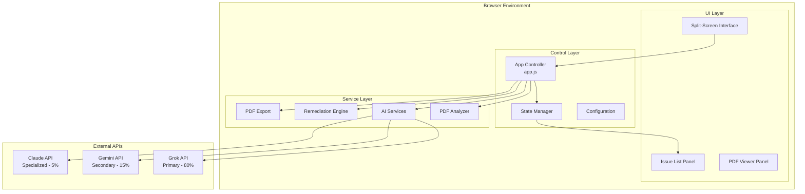
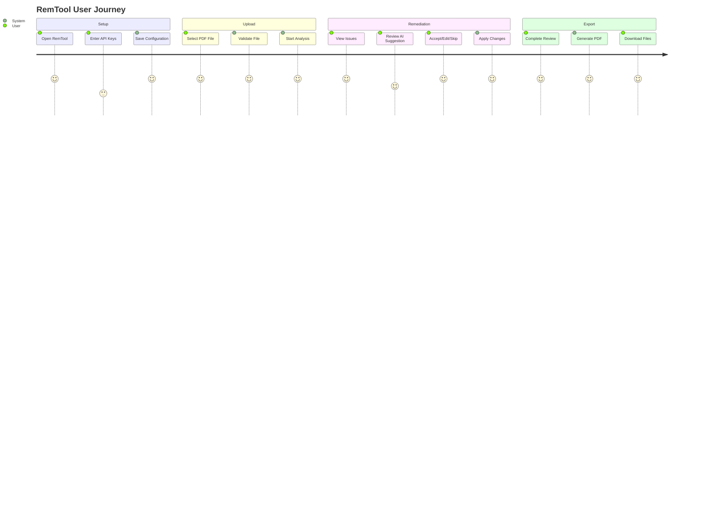
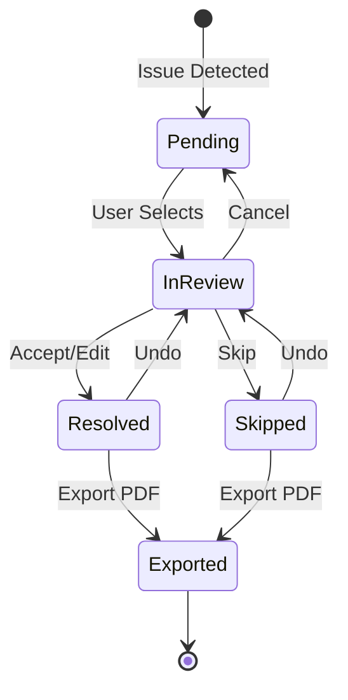
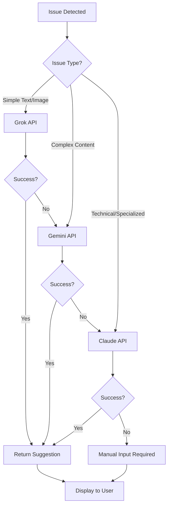
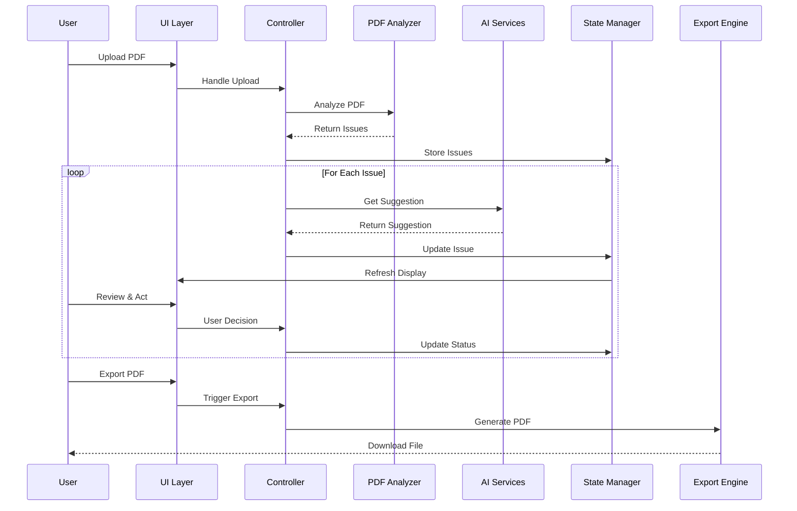

# RemTool Architecture Diagrams

## System Architecture Diagram

```mermaid
graph TB
    subgraph "Browser Environment"
        subgraph "UI Layer"
            UI[Split-Screen Interface]
            IL[Issue List Panel]
            PV[PDF Viewer Panel]
        end
        
        subgraph "Control Layer"
            APP[App Controller<br/>app.js]
            SM[State Manager]
            CFG[Configuration]
        end
        
        subgraph "Service Layer"
            PA[PDF Analyzer]
            AI[AI Services]
            REM[Remediation Engine]
            EXP[PDF Export]
        end
    end
    
    subgraph "External APIs"
        GROK[Grok API<br/>Primary - 80%]
        GEM[Gemini API<br/>Secondary - 15%]
        CL[Claude API<br/>Specialized - 5%]
    end
    
    UI --> APP
    APP --> SM
    SM --> IL
    APP --> PA
    APP --> AI
    APP --> REM
    APP --> EXP
    AI --> GROK
    AI --> GEM
    AI --> CL
```

## User Workflow Diagram

```mermaid
journey
    title RemTool User Journey
    section Setup
      Open RemTool: 5: User
      Enter API Keys: 3: User
      Save Configuration: 5: System
    section Upload
      Select PDF File: 5: User
      Validate File: 5: System
      Start Analysis: 5: System
    section Remediation
      View Issues: 5: User
      Review AI Suggestion: 4: User
      Accept/Edit/Skip: 5: User
      Apply Changes: 5: System
    section Export
      Complete Review: 5: User
      Generate PDF: 5: System
      Download Files: 5: User
```

## Issue Resolution State Machine

```mermaid
stateDiagram-v2
    [*] --> Pending: Issue Detected
    Pending --> InReview: User Selects
    InReview --> Resolved: Accept/Edit
    InReview --> Skipped: Skip
    InReview --> Pending: Cancel
    Resolved --> InReview: Undo
    Skipped --> InReview: Undo
    Resolved --> Exported: Export PDF
    Skipped --> Exported: Export PDF
    Exported --> [*]
```

## AI Service Selection Flow

```mermaid
flowchart TD
    A[Issue Detected] --> B{Issue Type?}
    B -->|Simple Text/Image| C[Grok API]
    B -->|Complex Content| D[Gemini API]
    B -->|Technical/Specialized| E[Claude API]
    
    C --> F{Success?}
    D --> G{Success?}
    E --> H{Success?}
    
    F -->|Yes| I[Return Suggestion]
    F -->|No| D
    
    G -->|Yes| I
    G -->|No| E
    
    H -->|Yes| I
    H -->|No| J[Manual Input Required]
    
    I --> K[Display to User]
    J --> K
```

## Component Interaction Sequence

```mermaid
sequenceDiagram
    participant U as User
    participant UI as UI Layer
    participant C as Controller
    participant PA as PDF Analyzer
    participant AI as AI Services
    participant SM as State Manager
    participant EX as Export Engine
    
    U->>UI: Upload PDF
    UI->>C: Handle Upload
    C->>PA: Analyze PDF
    PA-->>C: Return Issues
    C->>SM: Store Issues
    
    loop For Each Issue
        C->>AI: Get Suggestion
        AI-->>C: Return Suggestion
        C->>SM: Update Issue
        SM->>UI: Refresh Display
        U->>UI: Review & Act
        UI->>C: User Decision
        C->>SM: Update Status
    end
    
    U->>UI: Export PDF
    UI->>C: Trigger Export
    C->>EX: Generate PDF
    EX-->>U: Download File
```