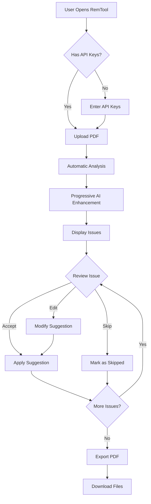
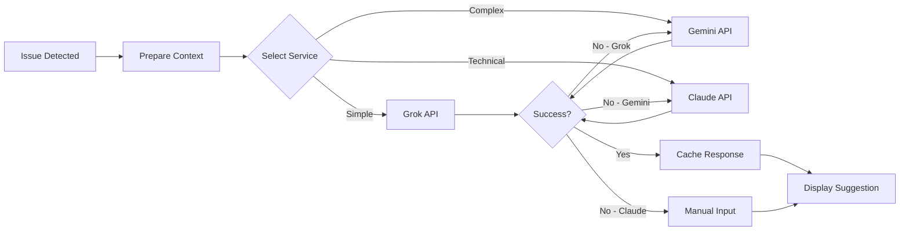
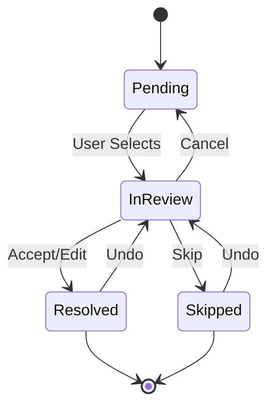

# RemTool Integrated Design Specification v3.0
*AI-Powered PDF Accessibility Remediation Tool*
*Last Updated: December 2024*

## Table of Contents
1. [Executive Summary](#executive-summary)
2. [System Architecture](#system-architecture)
3. [Core Components](#core-components)
4. [User Interface Design](#user-interface-design)
5. [Workflow Diagrams](#workflow-diagrams)
6. [AI Integration Strategy](#ai-integration-strategy)
7. [Implementation Status](#implementation-status)
8. [API Specifications](#api-specifications)
9. [Deployment Architecture](#deployment-architecture)
10. [Future Roadmap](#future-roadmap)

## 1. Executive Summary

### 1.1 Vision Statement
RemTool is a browser-based application that revolutionizes PDF accessibility remediation by combining automated detection with AI-powered suggestions in a human-in-the-loop workflow. It enables users to remediate PDFs 50% faster while maintaining full control over all accessibility decisions.

### 1.2 Key Innovations
- **Progressive AI Enhancement**: Issues are analyzed in parallel with AI services, providing suggestions as they become available
- **Multi-Service Redundancy**: Three-tier AI service architecture (Grok → Gemini → Claude) ensures reliability
- **Split-Screen Workflow**: Intuitive interface showing issues alongside the PDF with real-time highlighting
- **Intelligent Batching**: Similar issues can be remediated in bulk while maintaining quality
- **Client-Side Processing**: All PDF manipulation happens in the browser for security and privacy

### 1.3 Current Status
The Proof of Concept (PoC) is fully implemented with:
- Complete PDF analysis engine detecting 15+ accessibility issue types
- AI integration with fallback mechanisms
- Interactive remediation interface
- Export functionality producing tagged PDFs
- Responsive design supporting desktop and tablet workflows

## 2. System Architecture

### 2.1 High-Level Architecture

```
┌─────────────────────────────────────────────────────────────────┐
│                        RemTool Application                       │
├─────────────────────────────────────────────────────────────────┤
│                                                                 │
│  ┌─────────────┐  ┌─────────────┐  ┌─────────────┐           │
│  │   UI Layer  │  │  Controller │  │    State    │           │
│  │             │◄─┤    (app.js) │◄─┤   Manager   │           │
│  └─────────────┘  └─────────────┘  └─────────────┘           │
│         ▲                 ▲                ▲                   │
│         │                 │                │                   │
│  ┌──────┴──────┐  ┌──────┴──────┐  ┌─────┴──────┐           │
│  │ Remediation │  │     PDF     │  │     AI     │           │
│  │     UI      │  │  Analyzer   │  │  Services  │           │
│  └─────────────┘  └─────────────┘  └─────────────┘           │
│         ▲                 ▲                ▲                   │
│         │                 │                │                   │
│  ┌──────┴──────────────────┴────────────────┴──────┐         │
│  │              PDF.js Library Layer                │         │
│  └──────────────────────────────────────────────────┘         │
│                                                                 │
└─────────────────────────────────────────────────────────────────┘
                                │
                                ▼
                    ┌───────────────────────┐
                    │   External AI APIs    │
                    ├───────────────────────┤
                    │ • Grok (Primary)      │
                    │ • Gemini (Secondary)  │
                    │ • Claude (Specialized)│
                    └───────────────────────┘
```

### 2.2 Component Interaction Flow

```
User Upload ──► PDF Analyzer ──► Issue Detection ──► State Manager
                                                           │
                                                           ▼
                                                    AI Services
                                                           │
                                                           ▼
User Review ◄── Remediation UI ◄── Issue Display ◄── Enhanced UI
     │
     ▼
User Action ──► State Update ──► PDF Modifier ──► Export Engine
```

### 2.3 Module Dependencies

```
app.js
  ├── config.js
  ├── state-manager.js
  ├── pdf-analyzer.js
  │     └── enhanced-analyzer.js
  ├── ai-services.js
  ├── remediation-ui.js
  │     └── enhanced-ui.js
  └── pdf-export.js
```

## 3. Core Components

### 3.1 PDF Analyzer Module
**Purpose**: Detect accessibility issues in PDF documents

**Key Features**:
- Extracts document structure using PDF.js
- Identifies 15+ types of accessibility issues
- Provides page-level and document-level analysis
- Generates detailed issue metadata for AI context

**Issue Types Detected**:
1. Missing document title
2. Missing document language
3. Untagged content
4. Images without alt text
5. Improper heading hierarchy
6. Non-descriptive link text
7. Form fields without labels
8. Tables without headers
9. Lists with incorrect structure
10. Reading order problems
11. Color contrast issues
12. Decorative images not marked
13. Missing table summaries
14. Complex tables without proper markup
15. Inaccessible multimedia content

### 3.2 AI Services Module
**Purpose**: Manage AI API integrations with intelligent fallback

**Service Hierarchy**:
```
Primary: Grok API
  │
  ├── Fast response times
  ├── Good for basic alt text
  └── 80% of requests
  
Secondary: Gemini API  
  │
  ├── Better context understanding
  ├── Validation and alternatives
  └── 15% of requests
  
Specialized: Claude Sonnet API
  │
  ├── Complex technical content
  ├── Nuanced descriptions
  └── 5% of requests
```

**Key Features**:
- Automatic service selection based on content type
- Graceful fallback on API failures
- Request batching for efficiency
- Response caching to minimize API calls
- Context enrichment for better suggestions

### 3.3 State Manager Module
**Purpose**: Centralized state management for the entire application

**State Structure**:
```javascript
{
  document: {
    file: File,
    metadata: {},
    pages: []
  },
  issues: [{
    id: string,
    type: string,
    severity: 'error' | 'warning' | 'info',
    page: number,
    element: {},
    description: string,
    suggestion: {
      text: string,
      confidence: number,
      service: string
    },
    status: 'pending' | 'resolved' | 'skipped',
    userEdit: string
  }],
  ui: {
    currentIssue: number,
    filters: {},
    viewMode: string
  },
  config: {
    apiKeys: {},
    preferences: {}
  }
}
```

### 3.4 Remediation UI Module
**Purpose**: Dynamic interface generation based on issue type

**Interface Types**:
1. **Alt Text Editor**: Image preview, context, text input
2. **Heading Structure**: Level selector, outline view
3. **Reading Order**: Drag-and-drop reordering
4. **Table Structure**: Interactive grid for headers
5. **Form Labels**: Field association interface
6. **Link Text**: Context-aware text editor

### 3.5 PDF Export Module
**Purpose**: Generate accessible PDFs with applied remediations

**Features**:
- Applies all accepted remediations
- Maintains visual fidelity
- Adds proper PDF/UA tags
- Generates compliance report
- Validates output structure

## 4. User Interface Design

### 4.1 Layout Specification

```
┌─────────────────────────────────────────────────────────────────────┐
│  RemTool - PDF Accessibility Remediation              [Settings] [?] │
├─────────────────────────────────────────────────────────────────────┤
│                                                                     │
│  ┌─────────────────────────┬─────────────────────────────────────┐ │
│  │     ISSUES PANEL (40%)  │      PDF VIEWER (60%)               │ │
│  ├─────────────────────────┼─────────────────────────────────────┤ │
│  │ ┌─────────────────────┐ │  ┌────────────────────────────────┐ │ │
│  │ │   Issue Filters     │ │  │   ┌─┬─┬─┐  Page 1 of 12  ◄ ► │ │ │
│  │ │ Type: [All Types ▼] │ │  │   └─┴─┴─┘                    │ │ │
│  │ │ Page: [All Pages ▼] │ │  ├────────────────────────────────┤ │ │
│  │ │ Status: [Pending ▼] │ │  │                                │ │ │
│  │ └─────────────────────┘ │  │                                │ │ │
│  │                         │  │     [PDF Content Area]         │ │ │
│  │ ┌─────────────────────┐ │  │                                │ │ │
│  │ │   Issue Card #1     │ │  │     • Highlighted Issue        │ │ │
│  │ │   ⚠ Missing Alt     │ │  │                                │ │ │
│  │ │   Page 3, Image     │ │  │                                │ │ │
│  │ │   [Accept][Edit]    │ │  │                                │ │ │
│  │ └─────────────────────┘ │  │                                │ │ │
│  │                         │  │                                │ │ │
│  │ ┌─────────────────────┐ │  └────────────────────────────────┘ │ │
│  │ │  Remediation Panel  │ │                                      │ │
│  │ │  [Dynamic Content]  │ │  ┌────────────────────────────────┐ │ │
│  │ │                     │ │  │ Zoom: [100% ▼] [Highlight ✓]   │ │ │
│  │ └─────────────────────┘ │  └────────────────────────────────┘ │ │
│  └─────────────────────────┴─────────────────────────────────────┘ │
│                                                                     │
│  [Skip All Remaining]  [Accept All Suggestions]  [Export PDF]      │
└─────────────────────────────────────────────────────────────────────┘
```

### 4.2 Responsive Breakpoints

**Desktop (1280px+)**
- Full split-screen layout
- All features available
- Keyboard navigation enabled

**Tablet (768px - 1279px)**
- Stacked layout option
- Touch-optimized controls
- Simplified navigation

**Mobile (< 768px)**
- Not supported in PoC
- Future: Issues-only view with PDF preview

### 4.3 Visual Design System

**Color Palette**:
- Primary: #2563eb (Blue)
- Success: #16a34a (Green)
- Warning: #f59e0b (Amber)
- Error: #dc2626 (Red)
- Neutral: #6b7280 (Gray)

**Typography**:
- Headers: -apple-system, BlinkMacSystemFont
- Body: 'Segoe UI', Roboto, sans-serif
- Monospace: 'SF Mono', Consolas

**Component Styling**:
- Card-based design with subtle shadows
- 8px spacing grid
- Rounded corners (4px)
- Smooth transitions (200ms)

## 5. Workflow Diagrams

### 5.1 Main User Workflow



### 5.2 AI Service Flow



### 5.3 Issue Resolution State Machine



## 6. AI Integration Strategy

### 6.1 Context Preparation

Each AI request includes:
1. **Issue Context**:
   - Element type and properties
   - Surrounding text (2 paragraphs)
   - Page context
   - Document metadata

2. **Instruction Template**:
   ```
   Analyze this [ELEMENT_TYPE] for accessibility.
   Context: [SURROUNDING_TEXT]
   Current issue: [ISSUE_DESCRIPTION]
   Provide a concise [SUGGESTION_TYPE].
   Limit: [CHAR_LIMIT] characters.
   ```

### 6.2 Service Selection Logic

```javascript
Service Selection Rules:
├── Images
│   ├── Decorative → Grok
│   ├── Informational → Grok/Gemini
│   └── Complex diagrams → Claude
├── Text
│   ├── Headings → Grok
│   ├── Links → Grok
│   └── Technical content → Gemini/Claude
└── Tables
    ├── Simple (< 5 cols) → Grok
    ├── Complex → Gemini
    └── Nested → Claude
```

### 6.3 Optimization Strategies

1. **Request Batching**: Group similar issues
2. **Caching**: Store responses for identical content
3. **Progressive Loading**: Show UI while AI processes
4. **Fallback Chain**: Automatic service switching
5. **Rate Limiting**: Respect API quotas

## 7. Implementation Status

### 7.1 Completed Features ✅

**Core Functionality**:
- [x] PDF upload and validation
- [x] Comprehensive issue detection
- [x] AI service integration with fallbacks
- [x] Interactive remediation interfaces
- [x] State management system
- [x] PDF export with modifications
- [x] Compliance report generation

**User Interface**:
- [x] Split-screen layout
- [x] Issue filtering and sorting
- [x] Real-time PDF highlighting
- [x] Progress indicators
- [x] Keyboard navigation
- [x] Responsive design (desktop/tablet)

**AI Integration**:
- [x] Grok API integration
- [x] Gemini API integration
- [x] Claude API integration
- [x] Automatic fallback mechanism
- [x] Context-aware prompts
- [x] Response caching

### 7.2 Pending Features 🚧

**Planned for v2.0**:
- [ ] Batch file processing
- [ ] Undo/redo functionality
- [ ] Custom remediation templates
- [ ] Team collaboration features
- [ ] Cloud storage integration
- [ ] Advanced analytics dashboard

### 7.3 Known Limitations

1. **Page Limit**: 50 pages maximum (browser memory)
2. **File Types**: PDF only (no Word/HTML)
3. **Languages**: English interface only
4. **Browsers**: Modern browsers only (no IE)
5. **Features**: Some complex PDF features may not preserve

## 8. API Specifications

### 8.1 AI Service Endpoints

**Grok API**:
```
Endpoint: https://api.x.ai/v1/chat/completions
Model: grok-beta
Auth: Bearer token
Rate Limit: 60 requests/minute
```

**Gemini API**:
```
Endpoint: https://generativelanguage.googleapis.com/v1beta/models/gemini-pro:generateContent
Auth: API key
Rate Limit: 60 requests/minute
```

**Claude API**:
```
Endpoint: https://api.anthropic.com/v1/messages
Model: claude-3-sonnet-20240229
Auth: x-api-key header
Rate Limit: 50 requests/minute
```

### 8.2 Internal Module APIs

**PDFAnalyzer.analyze(file)**:
```javascript
Returns: {
  metadata: {
    title: string,
    author: string,
    language: string,
    pageCount: number
  },
  issues: Issue[],
  pages: PageData[]
}
```

**AIServices.getSuggestion(issue, context)**:
```javascript
Returns: {
  suggestion: string,
  confidence: number (0-1),
  service: 'grok' | 'gemini' | 'claude',
  processingTime: number
}
```

**StateManager.updateIssue(id, updates)**:
```javascript
Updates issue and triggers UI refresh
Returns: boolean (success)
```

## 9. Deployment Architecture

### 9.1 Local Development
```
remtool/
├── index-cdn.html      # Main entry point
├── app.js             # Application controller
├── config.js          # Configuration
├── modules/           # Core modules
│   ├── state-manager.js
│   ├── pdf-analyzer.js
│   ├── enhanced-analyzer.js
│   ├── ai-services.js
│   ├── remediation-ui.js
│   ├── enhanced-ui.js
│   └── pdf-export.js
├── styles/            # CSS files
│   ├── main.css
│   ├── components.css
│   └── responsive.css
├── lib/              # Local libraries (optional)
└── docs/             # Documentation
```

### 9.2 Production Deployment

**Option 1: Static Hosting**
- Host on GitHub Pages, Netlify, or Vercel
- No server required
- User provides own API keys

**Option 2: Server Deployment**
- Add backend for API key management
- Implement user authentication
- Enable team features

### 9.3 Security Considerations

1. **Client-Side Processing**: PDFs never leave browser
2. **API Key Storage**: LocalStorage with encryption option
3. **HTTPS Required**: For API communications
4. **CORS Configuration**: Properly configured endpoints
5. **Input Validation**: File type and size limits

## 10. Future Roadmap

### 10.1 Version 2.0 (Q2 2025)
- Remove page limit restriction
- Add batch processing capabilities
- Implement undo/redo functionality
- Create remediation templates
- Add progress saving/resuming

### 10.2 Version 3.0 (Q4 2025)
- Multi-user collaboration
- Cloud storage integration
- Custom AI model training
- Advanced analytics dashboard
- API for programmatic access

### 10.3 Long-term Vision
- Real-time screen reader preview
- Automatic regression testing
- Integration with popular CMSs
- Mobile application
- Multilingual support

## Appendices

### A. Accessibility Standards Reference
- WCAG 2.2 Level AA compliance
- Section 508 (Revised 2018)
- PDF/UA (ISO 14289-1:2014)
- ARIA Authoring Practices

### B. Browser Compatibility Matrix
| Feature | Chrome 90+ | Firefox 88+ | Safari 14+ | Edge 90+ |
|---------|------------|-------------|------------|----------|
| PDF.js  | ✅ | ✅ | ✅ | ✅ |
| ES6+    | ✅ | ✅ | ✅ | ✅ |
| Fetch API| ✅ | ✅ | ✅ | ✅ |
| Grid/Flex| ✅ | ✅ | ✅ | ✅ |

### C. Performance Benchmarks
- 50-page PDF analysis: < 30 seconds
- AI suggestion per issue: < 5 seconds
- UI interaction response: < 100ms
- Export generation: < 60 seconds
- Memory usage: < 500MB

---

*This specification represents the current state of RemTool as implemented, incorporating lessons learned during development and reflecting the actual architecture and capabilities of the system.*